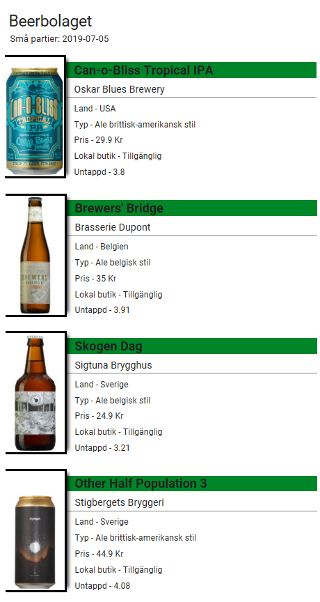
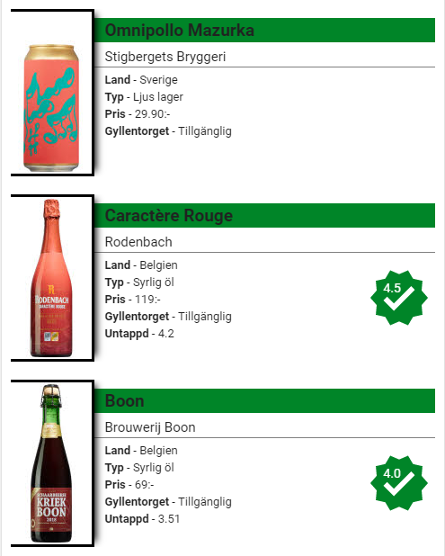

# Beerbolaget-card
A custom card for displaying information provided by [`Beerbolaget`](https://github.com/Ceerbeerus/beerbolaget).



A simple tap/click on a picture takes you to the product page of chosen beer.

## Setup
This card is available for integration in two ways, which is described below.

### Local integration
To add this card to your home assistant configuration, download the file (beerbolaget-card.js) and place it under <config_dir>/www/.

Add the following to your ui-lovlace.yaml
```yaml
- url: /local/beerbolaget-card.js
  type: js
```

## Releases
Please note that:

* release 0.0.5 of this card requires [`Beerbolaget`](https://github.com/Ceerbeerus/beerbolaget) 0.1.8 or later to function properly.
* release 0.0.7 of this card requires [`Beerbolaget`](https://github.com/Ceerbeerus/beerbolaget) 0.1.9 or later to function properly.
* release 0.0.8 of this card requires [`Beerbolaget`](https://github.com/Ceerbeerus/beerbolaget) 0.2.2 or later to function properly.

* release 0.1.27 < of this card requires [`Card-Mod`](https://github.com/thomasloven/lovelace-card-mod) for best experience.
* release 0.1.34 < supports custom styling.

### Integration through HACS
Install the card in HACS and add the following to your ui-lovelace.yaml
```yaml
- url: /community_plugin/beerbolaget-card/beerbolaget-card.js
  type: js
```

## Required/Options
[`Beerbolaget`](https://github.com/Ceerbeerus/beerbolaget) component is required to use this card.

|Name                |Default       |Supported options                                 |Description                                                                                                                                                                                                                                                                                                                                    |
| --------------     | ------------ | ------------------------------------------------ | --------------------------------------------------------------------------------------------------------------------------------------------------------------------------------------------------------------------------------------------------------------------------------------------------------------------------------------------- |
|`entity`            |`None`        |`String`                                          |Required entity of Beerbolaget sensor.
|`rating`            |`false`       |`false \| true`                                   |Display ratings from Untappd. This required to also have this option added in the setup of Beerbolaget component.
|`user_ratings`      |`false`       |`false \| true`                                   |Display your ratings for beers you have checked in using Untappd. This required to also have Untappd token option added in the setup of Beerbolaget component.
|`filter_local`      |`false`       |`false \| true`                                   |Filter to only show beers available at the local store. A store must be added as option in the setup of Beerbolaget component.

## Styling options

|Name                       |Default       |Supported options                                 |Description                                                                                                                                                                                                                                                                                                                                           |
| --------------------------- | ------------ | ------------------------------------------------ | --------------------------------------------------------------------------------------------------------------------------------------------------------------------------------------------------------------------------------------------------------------------------------------------------------------------------------------------- |
|`header_background_color`    |`#008528`     |`string`                                          |Color of the header backgound, can be any valid CSS color value or variable.
|`header_text_color`          |`#fcd303`     |`string`                                          |Color of the header text, can be any valid CSS color value or variable.
|`beer_name_background_color` |`#008528`     |`string`                                          |Color of the beer names background, can be any valid CSS color value or variable.
|`beer_name_color`            |`#fcd303`     |`string`                                          |Color of the beer names, can be any valid CSS color value or variable.
|`release_date_color`         |`#fcd303`     |`string`                                          |Color of release date, can be any valid CSS color value or variable.
|`available_color`            |`#000000`     |`string`                                          |Color of the availability text when the beer is available, can be any valid CSS color value or variable.
|`not_available_color`        |`#000000`     |`string`                                          |Color of the availability text when the beer isn't available, can be any valid CSS color value or variable.


### Layout when `user_ratings` is enabled


## Example
  ```yaml
  view:
    cards:
      -type: custom:beerbolaget-card
       entity: sensor.beerbolaget
       rating: true
       user_ratings: true
       filter_local: true
  ```
